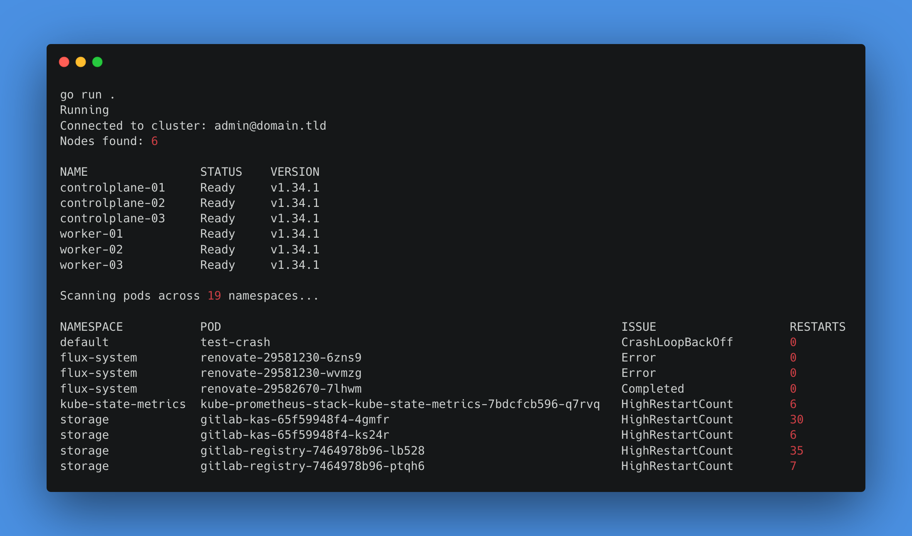
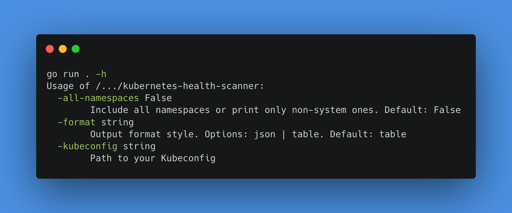
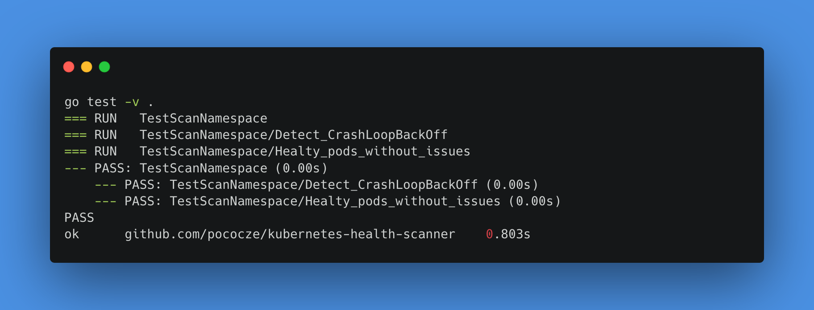

# Kubernetes Cluster Health Scanner

CLI tool that connect to Kubernetes cluster and scans for health issues such as Pods with high restart counts, OOMKilled, CrashLoopBackOff, DiskPressure and more. This project introduces the power of goroutines, channels and waitGroup.

*Note: Default output is without system namespaces. Those can be changed in the types.go file.*

## What the tool can do

1. Connect to cluster via kubeconfig
2. List all nodes with their conditions (Ready, MemoryPressure, DiskPressure, ...)
3. Scan pods across namespaces for problems: `CrashLoopBackOff`, `OOMKilled`, high restart counts, stuck pending pods
4. Scan namespaces **concurrently** using goroutines
5. Output a health report in table or JSON format
6. CLI flags for kubeconfig path, namespace filter, output format

## New Go concepts used

- External dependencies using `go get`
- Splitting code across files
- Goroutines to scan namespaces concurrently
- Channels for collecting results from goroutines
- Waiting for all goroutines to finish using `sync.WaitGroup`
- Interfaces for testability

## Note on variable code change

To change the default behaviour of the tool - you can change constants `containerRestartCountTreshold` that set the treshold to mark container with issue *HighRestartCount*, `maxParallelRequests` changes the default number (5) of parallel requests agains Kubernetes API server. You can also definitely change the `systemNamespaces` slice to replicate your cluster system namespaces that you would like to ommit by default.

## Using `go get` to install go client

```bash
go get k8s.io/client-go@latest
go get k8s.io/api@latest
go get k8s.io/apimachinery@latest
```

## Info about splitting code

When switching from single file to splitting the Go code into multiple files - running Go file like this `go run main.go` will not longer work.

So, to get the code working this time, everything in the directory needs to be compiled and ran - like this:

```bash
go run .
```

## Import alias

Meta alias such as `metav1` was used in the code to refer to the package as `metav1` instead of its full name.

## Parameters available



## Tests result



## JSON Output example

```json
go run . -format json
{
 "current_context_name": "admin@domain.tld",
 "node_count": 6,
 "nodes": [
  {
   "name": "controlplane-01",
   "status": "Ready",
   "version": "v1.34.1"
  },
  {
   "name": "controlplane-02",
   "status": "Ready",
   "version": "v1.34.1"
  },
  {
   "name": "controlplane-03",
   "status": "Ready",
   "version": "v1.34.1"
  },
  {
   "name": "worker-01",
   "status": "Ready",
   "version": "v1.34.1"
  },
  {
   "name": "worker-02",
   "status": "Ready",
   "version": "v1.34.1"
  },
  {
   "name": "worker-03",
   "status": "Ready",
   "version": "v1.34.1"
  }
 ],
 "namespace_count": 19,
 "pod_issues": [
  {
   "namespace": "storage",
   "pod": "gitlab-kas-65f59948f4-ks24r",
   "issue": "HighRestartCount",
   "restart_count": 11
  },
  {
   "namespace": "storage",
   "pod": "gitlab-registry-7464978b96-72p6p",
   "issue": "HighRestartCount",
   "restart_count": 6
  },
  {
   "namespace": "storage",
   "pod": "gitlab-registry-7464978b96-lb528",
   "issue": "HighRestartCount",
   "restart_count": 41
  },
  {
   "namespace": "storage",
   "pod": "gitlab-webservice-default-78c858978c-xxh8g",
   "issue": "HighRestartCount",
   "restart_count": 6
  },
  {
   "namespace": "flux-system",
   "pod": "renovate-29584110-28mz6",
   "issue": "Completed",
   "restart_count": 0
  },
  {
   "namespace": "default",
   "pod": "test-crash",
   "issue": "Error",
   "restart_count": 0
  }
 ]
}
```
